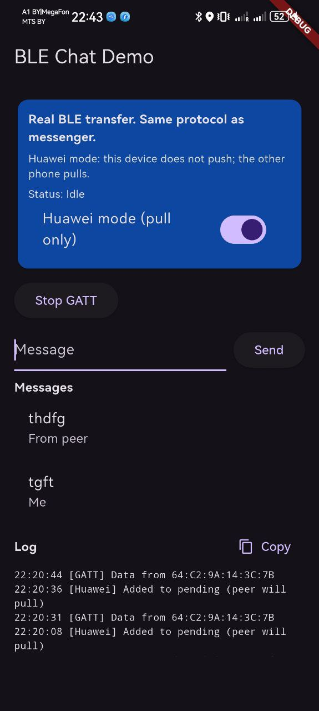
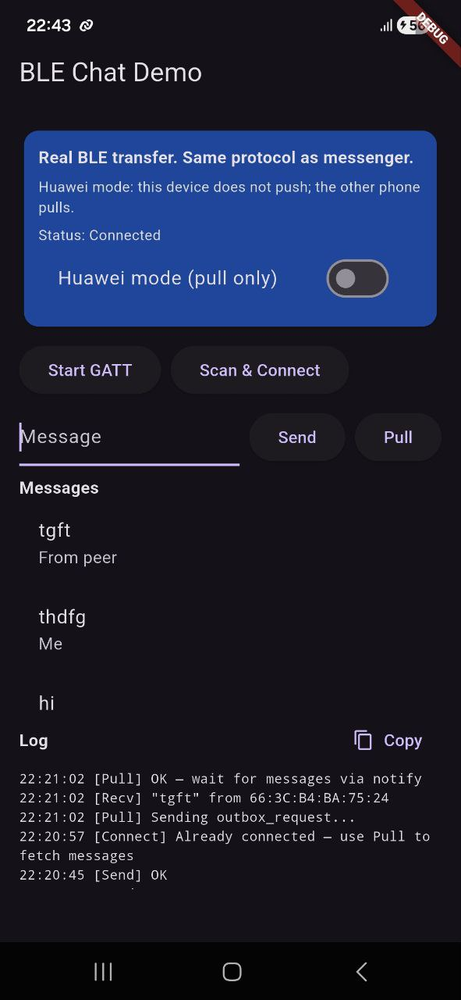

# Flutter BLE Messaging Demo

Peer-to-peer messaging between smartphones using **Bluetooth Low Energy (BLE)**.

This demo shows how two phones can connect directly and exchange messages **without internet** using a custom BLE messaging protocol.

The project demonstrates a lightweight BLE transport layer that can be used for:

* offline messaging
* IoT device communication
* mesh networking experiments
* peer-to-peer data exchange

---

## Documentation

Protocol documentation:
https://github.com/pslergy/flutter-ble-messaging-demo/tree/main/docs

---

## Features

• BLE peer-to-peer communication
• Chunked message transfer
• Message framing protocol (4-byte length + JSON)
• Automatic message reassembly
• Huawei device compatibility workaround
• Flutter + Android BLE implementation

---

## Demo APK

Download the demo application from the **Releases page**:

➡️ **https://github.com/pslergy/flutter-ble-messaging-demo/releases*

Install the APK on two phones and start a BLE connection.

---

## Screenshots

---

## How it works

One device acts as **BLE Central** and scans for devices.

The other device acts as **BLE Peripheral (GATT server)**.

Messages are transferred using:

• chunked BLE writes
• a framing protocol (4-byte message length)
• notify stream reassembly

This allows sending messages larger than the BLE packet size.

---

## Possible Use Cases

• offline messaging
• BLE device communication
• mesh networking experiments
• IoT prototypes
• peer-to-peer data exchange

---

## Source Code

The **full source code** of this project is available separately.

It includes:

• Flutter BLE transport layer
• Android GATT server implementation
• message framing protocol
• chunked BLE transfer logic
• working demo application

Commercial license and source code access are available **on request**.

➡️ Contact for access: **(pslergy@gmail.com / link)**

After purchase you will receive access to the **private repository**.

---

## License

This repository contains **demo binaries and documentation only**.

The complete source code is available under a **commercial license**.
